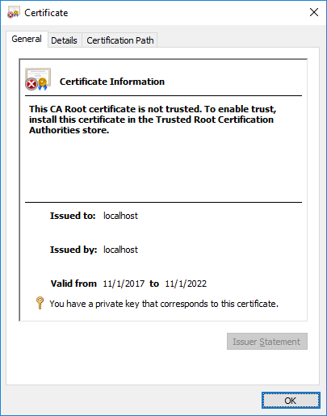
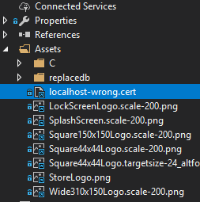

Communication between Couchbase Lite and Sync Gateway is encrypted and secured using SSL/TLS. The SSL/TLS protocol relies on a Public Key Infrastructure (PKI) mechanism using a X.509 certificate to establish the Sync Gateway server’s identity. The certificate is typically issued/signed by a trusted Certificate Authority and is installed on the Sync Gateway. In a development environment, this certificate may be self-signed.

If the trustworthiness of the certificate is somehow compromised or if you are using a self signed certificate, then the identity of the server cannot be reliably established and there can be no confidentiality guarantees on the communication between the client and server.
To alleviate these issues, Couchbase Lite supports certificate pinning. Certificate pinning is a technique that can be used by applications to “pin” a host to it’s certificate/public key. The certificate is typically delivered to the client by an out-of-band channel and bundled with the client. By pinning the certficate, the verifying client application no longer needs to rely on a third party trusted party for verifying the signature and this technique will also work with self signed certificates.
This post will discuss how to pin certificates within your Couchbase Lite .NET application (applicable to any supported platform).


Release 1.4 of Couchbase Lite only supports certificate pinning in iOS. The upcoming 2.0 Release (now in Developer Preview) will support pinning on all supported platforms. Code snippets discussed in this post applies to the current production version of Couchbase Lite. Stay tuned for a future blog post on on certificate pinning in Release 2.0.

## The Problem

Communication between Couchbase Lite and Sync Gateway is encryped using SSL/TLS.

At a very high level, the TLS protocol works as follows.
A X.509 certificate containing the public key and server identity is installed on the Sync Gateway. This public key certificate may be signed by a trusted third party Certificate Authority or may be self-signed, the latter typically the case in development environments.
During connection establishment, the client app running Couchbase Lite verifies the identity of the Sync Gateway using the server certificate. Couchbase Lite uses the trusted CA’s root certificate to validate the certificate. Once verified, the client proceeds with the secret key exchange. The shared secret is then used to encyrpt communication between the client and Sync Gateway.


Please refer to the RFC for specifics on the SSL/TLS protocol.

There are some issues with this approach :-
– While under most circumstances, it is reasonable to rely on the trustworthiness of the CA, it is possible for a CA itself to be compromised. If that happens, then there is no reliable way to authenticate the Sync Gateway because the CA that is used for the verification itself is not trustworthy!
– The client-server communication may be subject to a Man-in-the-Middle (MiTM) attack whereby a rogue server impersonating as a Sync Gateway can issue a fake certificate representing the Sync Gateway, signed by a bogus CA. If the client is somehow misled to include the fake CA’s certificate in it’s trusted root Certificate Authority store, then the client will trust the fake certificate signed by the bogus CA. This will result in the client now communicating with a bogus Sync Gateway.
– If you are using self-signed certificates in your development environment, there is no way for the client to reliably validate the identity of the server.

## A Solution – Certificate Pinning

One common way to handle the issues above is to “pin” the Sync Gateway server to it’s certificate/public key. In this technique, the Couchbase Lite is pre-configured with the trusted Sync Gateway certificate. So during connection establishment, Couchbase Lite uses this pre-configured certificate to verify the identity of the server. This removes the reliance on an external third party CA for verification of certificate.
The OWASP website is a good reference on Certificate Pinning.

## Caveat

It is important to note that since the applications are bundled with the certificate, every time the certificate expires, the application needs to be updated with the new certificate. This may be a bit more challenging in mobile environments where app releases may require App Store reviews and the onus is on the users to upgrade their apps. So be aware of when the certificates expire and make appropriate plans to publish the applications with the new certificates.

## Background

The Couchbase Mobile stack includes the Couchbase Lite embedded database running locally on devices and Sync Gateway in the cloud which is typically backed by Couchbase server persisting the data in the cloud. The Sync Gateway handles the replication of documents across the devices.

### Installing Certificate on the Sync Gateway

Follow the instructions in the [Couchbase Developer Portal](https://developer.couchbase.com/documentation/mobile/current/guides/sync-gateway/configuring-ssl/index.html) to install relevant server certificate on your Sync Gateway

Couple of points to note during certificate generation:

– The certificate and corresponding private key must be in .pem format
– Install the certificates in a location accesible to the Sync Gateway
– If you are generating a self-signed certificate, probably the most important field is the `CommonName`. It should be your Sync Gateway’s FQDN. If you Sync Gateway does not have one, then you must specify use `localhost` for localhost or the static IPAddress of your Sync Gateway.

## Mac:<Br>


## Windows:<br>


Once configured, your sync gateway should be accesible via https.

## Bundling Certificate in your .NET

- Optional: Convert the PEM certificate in der format using command below (.NET will accept PEM or DER, as per the `X509Certificate2` constructor)

	```bash
	openssl x509 -inform PEM -in cert.pem -outform DER -out cert.cer
	```

	You can refer to this [SSL cheat sheet](https://www.sslshopper.com/article-most-common-openssl-commands.html) for details on the various openSSL commands.

- Open your project in Visual Studio and add the certificate in a way that will result in a copy of it being accessible in the final product (either by opening a stream, or by filename).  There are many ways to accomplish this, but there is probably only one way to bundle it and have it be the same on every platform and that is via adding it as an **Embedded Resource**.  This will embed the file directly into the DLL, and it will be accessible by stream inside the application.

- After copying, your project structure would be something like this

&nbsp;&nbsp;

- Pinning the Sync Gateway Server Certificate
  This takes just a few lines of code.
	
	```csharp
  var config = new ReplicatorConfiguration();
  
	// 1: Get the stream to the data (if using embedded resource, otherwise you can get it
  // via your own logic, or just pass the file path if available)
  using (var certStream = GetType().GetTypeInfo().Assembly.GetManifestResourcesStream("localhost-wrong.cert"))
  using (var reader = new BinaryReader(certStream)) {
      // 2 : Load the certificate
      var bytes = reader.Read(certStream.Length);
      
      // 3: Create an X509Certificate2
      var cert = new X509Certificate2(bytes);
      
      // 4: Set the certificate on the replicator configuration
      config.PinnedServerCertificate = cert;
  }
	```

	Steps 1 and 2 are self explanatory.

	Step 3: [X509Certificate2](https://msdn.microsoft.com/en-us/library/system.security.cryptography.x509certificates.x509certificate2(v=vs.110).aspx) is a .NET object that represents a X.509 certificate

	Step 4: The Couchbase Replicator must be configured with the Sync Gateway certificate using the `PinnedServerCertificate` property on the [ReplicatorConfiguration](http://docs.couchbase.com/mobile/2.0/couchbase-lite-net/db021/html/T_Couchbase_Lite_Sync_ReplicatorConfiguration.htm) object. All other SSL certificates, valid or otherwise, will be rejected if you do so.

That’s it! With just a few steps, you can enable certificate pinning in your .NET application.
